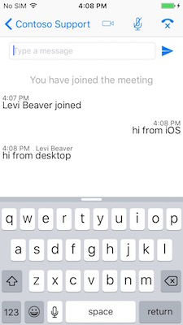

#Skype for Business iOS SDK

In this lab you will get hands-on experience developing an iOS app with Skype for business integration. The sample app will allow an anonymous user to join an existing skype meeting with chat, audio, and video.

**Prerequisites:** Before you begin, you must have XCode installed on your development workstation.

##Setting up the code
1. Open `SkypeiOSDemo/SkypeiOSDemo/SkypeiOSDemo.xcodeproj` in XCode. In the starting solution we have already set up the UI for this demo. You will be filling in the skype integration code.
>Note:  
>There are two different versions of the SDK depending on if you are running in the simulator or on a physical device.  
>To run the project in the **simulator**, copy AppSDKiOSSimulator/SFB.Framework into the SkypeiOSDemo folder.  
>To run the project on a **physical device**, copy AppSDKiOS/SFB.Framework into the SkypeiOSDemo folder.  

2. Run the project to make sure you are running the correct SDK. You should see the following screen. Clicking the Chat with Support button will navigate to the join meeting UI.   
    

3. The starting project has all of the UI elements and View Controllers have already been setup, as well as a few Util functions in the Utils.swift file. For the rest of the lab we will be filling in the Skype for Business integration code. Take a moment to look at the Main.storyboard to familiarize your self with the screens we will be working with.

##Join a meeting
In this section we will add the Skype SDK code to join a meeting as an anonymous user. When joining a meeting through the SDK, all you need is the meeting URL. In our app we will allow a user to type in a display name, and then click the join button to join the meeting.


>Note:  
>When joining a meeting the audio and chat portions of the meeting will be started automatically. Depending on the meeting settings, the meeting organizer might have to admit the anonymous user to the meeting. At the time of writing this, the meeting organizer also needs to unmute the anonymous user before that user is able to speak.

1. First we need to create a Skype meeting. Go to your Office 365 home page and follow these instructions.

    Open your calendar
      
    Click New to create a new meeting
    
    Click add Skype meeting to create the meeting URL
    
    Then click send to add it to your calendar so you can easily retrieve the link later
    
    
    
2. The Contoso Support view has a view controller already created called `SupportViewController.swift`. Open this file side by side with the storyboard by clicking on the storyboard and opening the assistant editor. Notice that the UI elements we will be interacting with have already been setup for you. There are outlets for the join button, and display name textbox and an action outlet for the join button click action.

3. First we need to setup a few properties on this controller to interact with the SDK. Copy the following code into the controller under the `@IBOutlet` properties.

    ```swift
    private var sfbApp: SFBApplication!
        
    var conversationsManager: SFBConversationsManager? {
    	willSet {
        	conversationsManager?.removeObserver(self, forKeyPath: "canGetOrCreateConversationMeetingByUri", context: &kvo)
        }
        didSet {
        	conversationsManager?.addObserver(self, forKeyPath: "canGetOrCreateConversationMeetingByUri", options: [.Initial], context: &kvo)
        }
    }
        
    private var conversation: SFBConversation?
    
    override func viewDidLoad() {
        super.viewDidLoad()
        sfbApp = SFBApplication.sharedApplication()
        conversationsManager = sfbApp.conversationsManager
        sfbApp.configurationManager.maxVideoChannels = 1
    }
        
    deinit {
        setValue(nil, forKey: "conversationsManager")
    }
    ```
    In the code above we have defined and initialized three new properties. The `SFBApplication` property is the top level property for the SDK and it is initialized by calling the `sharedApplication` function. The `SFBApplication` will give you access to the `SFBConversationsManager`, and the `SFBConfigurationManager`. The `SFBConverstaionsManager` will manage a list of all conversations that you are joined to. For this tutorial, we will only be joining one conversation but take a look at the include sample code in the SDK for how to manage multiple conversations. The conversation property will be used to store the conversation that we will join in the next step.
    
    Finally we add an observer to the conversations manager that will notify us when we can join a meeting. In the deinit function we set the conversationsManager property to nil to make sure that our observer is removed.
    >Note:  
    >The SDK only supports a max of 1 video channels. With the final SDK the `sfbApp.configurationManager.maxVideoChannels = 1` line will not be needed and multiple video channels will be supported. 
    
4. Now let's implement the `joinMeeting` function. This function has already been setup as an action outlet for the join button click event. Copy the following code into the joinMeeting function.

    ```swift
    sfbApp.configurationManager.displayName = displayName.text!
    conversation = try! conversationsManager!.getOrCreateConversationMeetingByUri(NSURL(string: "YOUR_MEETING_URL")!)
    ```
    The first line of this code configures the display name for the anonymous user by getting the text from the `displayName` textbox. The second line will try to join the meeting based off a meeting URL. Be sure to replace `YOUR_MEETING_URL` with the meeting URL that was setup in step 1.
    >Note:  
    >The join button is already wired up to navigate to the conversation screen after it is clicked. You can see this in the Main.storyboard file
     
5. Notice that this call will throw an exception if `canGetOrCreateConversationMeetingByUri` is false. To make sure no one can start a meeting while that property is false, lets listen to our observer and enable/disable the join button as needed. Implement the following code to start listing to our observers.

    ```swift
    override func observeValueForKeyPath(keyPath: String?, ofObject object: AnyObject?, change: [String : AnyObject]?, context: UnsafeMutablePointer<Void>) {
        guard context == &kvo else {
            return super.observeValueForKeyPath(keyPath, ofObject: object, change: change, context: context)
        }
        
        assert(keyPath == "canGetOrCreateConversationMeetingByUri")
        join.enabled = conversationsManager!.canGetOrCreateConversationMeetingByUri
    }
    ```
    
    This function will automatically get called when `canGetOrCreateConversationMeetingByUri` changes since we added an observer in step 3.
    
6. That is all the code needed to join a meeting. Now if we run the app, we can type in a display name and click join. To test the app make sure you are also joined to the meeting as the meeting organizer. When you click join you should see the anonymous user join the meeting with the display name you typed on the phone. Since the audio meeting is started automatically, you will also be able to hear anyone else in the meeting (they can't hear you yet since you start the meeting muted, but we will fix that in the next section)
    >Note:  
    >When using the default meeting settings in Skype for Business any anonymous users need to be admitted into the meeting before they can fully join. For ease of testing, you might want to disable this option so they are admitted automatically to the meeting, and then leave the meeting running as we continue to develop the app.

##Adding Audio
In this section we will wire-up our audio button (/). This will allow the user to un-mute and talk in the audio call. Clicking this button will toggle between muted () and un-muted () states.  


>Note:  
>The anonymous users joins the call in a muted state. Before the user can un-mute themselves, the meeting organizer must un-mute them first. After this, the muted and un-muted states can be toggled by the user.

###Muting and Un-muting

1. Open the Main.storyboard file, and select the Conversation view. If you haven't already click the assistant editor button to view the `ConversationViewController` code. Just like the previous view controller, all of the UI outlets have been setup for you. The pieces that we care about in this section, are the audio button (/) outlet and the joinAudio action outlet.
2. First we need to setup a few properties to interact with the conversation and audio using the SDK. Add the following code.

    ```swift
    var conversation: SFBConversation? {
        didSet {
            audioService = conversation?.audioService            
        }
    }
    
    private var audioService: SFBAudioService? {
        willSet {
            audioService?.removeObserver(self, forKeyPath: "isMuted", context: &kvo)
            audioService?.removeObserver(self, forKeyPath: "canSetMuted", context: &kvo)
        }
    }
    
    deinit {
        setValue(nil, forKey: "conversation")
    }
    ```
    
    To interact with the audio portion of the meeting we need the current conversation (we will populate that in a second) and the audio service for that conversation. For now, don't worry about the code removing the observers, we will get to that in a later step.

3. Now that we have a property to hold the current conversation we need to pass the current conversation, that we created when we joined the meeting, to the conversation view. Open the `SupportViewController` again and implement the `prepareForSeque` function to pass the current conversation to our `ConversationViewController`.
    
    ```swift
    override func prepareForSegue(segue: UIStoryboardSegue, sender: AnyObject?) {
        guard let destination = segue.destinationViewController as? ConversationViewController else {
            return
        }
        destination.conversation = conversation
    }
    ```
    The `prepareForSeque` function will get called when we navigate to the `ConversationView` and allows us to perform any actions on our destination controller before we display the next view. The first part of this code, is just a simple guard statement to make sure our destination controller is the controller we are expecting. Then we assign the current conversation to that controller.

4. Now that the `ConversationViewController` has the current conversation, switch back to that controller and we will wire up the audio button. Update the `viewDidLoad` function to add observers to the `audioService`.

    ```swift
    audioService!.addObserver(self, forKeyPath: "isMuted", options: [.Initial], context: &kvo)
    audioService!.addObserver(self, forKeyPath: "canSetMuted", options: [.Initial], context: &kvo)
    ```
    We are adding observers to two properties of the audio service. First the `isMuted` property, when this property changes, we want to swap out our buttons image to the correct image. Second is the `canSetMuted` property, when this changes we will want to disable/enable our button. We are adding the observers in the `viewDidLoad` function because we only want to update our UI after the view has loaded.

5. Now we need to listen for changes on our new observers. Implement the `observeValueForKeyPath` function to listen for these changes.

    ```swift
    override func observeValueForKeyPath(keyPath: String?, ofObject object: AnyObject?, change: [String : AnyObject]?, context: UnsafeMutablePointer<Void>) {
        guard context == &kvo else {
            return super.observeValueForKeyPath(keyPath, ofObject: object, change: change, context: context)
        }
        
        switch keyPath! {
        case "canSetMuted":
            audio.enabled = audioService?.canSetMuted == true
        case "isMuted":
            audio.setImage(audioService!.isMuted ? UIImage(named: "mute") : UIImage(named: "audio"), forState: .Normal)
        default:
            break
        }
    }
    ```
    The observer code is a bit more complex than the previous view. In this view we will be listening to a lot of changes from the SDK, so we have to implement this function using a switch on the `keyPath` and perform the appropriate actions. The `keyPath` variable will tell the code which property changed. For now when `canSetMuted` is updated we update the enabled property on our audio button (/). When `isMuted` is updated, we will swap out our button images to the correct image.
    >Note:  
    >All of the images for this app are already added to the project. You can see all our image resources in the Assets.xcassets file.

6. Finally we will update the `toggleMute` function to toggle mute on the `audioService`

    ```swift
    @IBAction func toggleMute() {
        try! audioService?.setMuted(!audioService!.isMuted);
    }
    ```
    This code will try to toggle the mute state of the `audioService`. This function will throw an exception if `canSetMute` is false.
    
7. When you run the app we will now be able to participate in the full audio conversation.

###Switching Speakers
1. To switch the speakers from the handset speaker to the loud speaker, we will need access to the `SFBDeviceManager`. Lets add a property for the device manager to the `ConversationViewController`.

    ```swift
    var devicesManager: SFBDevicesManager? {
        willSet {
            devicesManager?.selectedSpeaker.removeObserver(self, forKeyPath: "activeEndpoint", context: &kvo)
        }
    }
    ```
    Add an observer in the `viewDidLoad` function to observer the `activeEndpoint` property. This property is the currently selected speaker, and when it changes we want to update our UI so the user knows which speaker they are using.
    
    ```swift
    override func viewDidLoad() {
        super.viewDidLoad()
        message.delegate = self
        audioService!.addObserver(self, forKeyPath: "isMuted", options: [.Initial], context: &kvo)
        audioService!.addObserver(self, forKeyPath: "canSetMuted", options: [.Initial], context: &kvo)
        devicesManager?.selectedSpeaker.addObserver(self, forKeyPath: "activeEndpoint", options: [.Initial], context: &kvo)
    }
    ```
    Update `deinit` to clear the `devicesManager` property when the view is destroyed, so our new observer is removed.
    
    ```swift
    deinit {
        leave()
        setValue(nil, forKey: "conversation")
        setValue(nil, forKey: "devicesManager")
    }
    ```
2. Update the `observeValueForKeyPath` function to listen for changes on the `activeEndpoint` property and update the text on our switch speaker button.

    ```swift
    override func observeValueForKeyPath(keyPath: String?, ofObject object: AnyObject?, change: [String : AnyObject]?, context: UnsafeMutablePointer<Void>) {
        guard context == &kvo else {
            return super.observeValueForKeyPath(keyPath, ofObject: object, change: change, context: context)
        }
        
        switch keyPath! {
        case "canSetMuted":
            audio.enabled = audioService?.canSetMuted == true
        case "isMuted":
            audio.setImage(audioService!.isMuted ? UIImage(named: "mute") : UIImage(named: "audio"), forState: .Normal)
        case "activeEndpoint":
            speaker.setTitle("Switch Speaker - \(devicesManager!.selectedSpeaker.activeEndpoint.description)", forState: .Normal)
        default:
            break
        }
    }
    ```
    
    >Note: The `Utils.swift` file has an extension defined for `SFBSpeakerEndpoint` that adds the string description to the endpoint enum.
    
3. Update the `switchSpeaker` function to toggle the `activeEndpoint` between the headset speaker, and the loudspeaker.

    ```swift
    @IBAction func switchSpeaker() {
        guard let speaker = devicesManager?.selectedSpeaker else {
            return
        }
        speaker.activeEndpoint = (speaker.activeEndpoint == .Loudspeaker) ? .NonLoudspeaker : .Loudspeaker
    }
    ```
    Now when the user clicks the switch speaker button, we will toggle between our two speakers, and then update the text of the button to display which speaker is the current speaker.
    
4. The last thing we need to do is pass the device manager to the `ConversationViewController`. The device manager is part of the `SFBApplication` object, so we need to go back to our join screen. Open the `SupportViewController`, and update the `prepareForSegue` function to set the device manager.

    ```swift
    override func prepareForSegue(segue: UIStoryboardSegue, sender: AnyObject?) {
        guard let destination = segue.destinationViewController as? ConversationViewController else {
            return
        }
        destination.conversation = conversation
        destination.devicesManager = sfbApp.devicesManager
    }
    ```
5. Run the app, and toggle between the two speakers on your phone.

##Displaying Conversation History and Chat Messages

In this section we will update the `HistoryTableViewController` to display the conversation history. This will allow anyone else in the meeting to send you messages and you will also be able to see other status events such as when users join the meeting.


###Setting Up the Table View
1. Go to the History Table View Controller on the storyboard and open the assistant editor to view the `HistoryTableViewController`. This controller will be responsible for listening to the `historyService` from our conversation and displaying the correct table cell.
2. First add a property for the history service

    ```swift
    var historyService: SFBHistoryService? {
        willSet {
            historyService?.removeObserver(self, forKeyPath: "activityItems")
        }
        didSet {
            historyService?.addObserver(self, forKeyPath: "activityItems", options: [.Initial], context: &kvo)
        }
    }
    
    deinit {
        setValue(nil, forKey: "historyService")
    }
    ```
    The history service keeps a list of activities that have happened in this conversation. We are adding an observer to track this list and get notified when a new activity is added to the list.
    
3. Now that we have a history service property on the `HistoryTableViewController`, we need to assign the service to it. Switch back to the `ConversationViewController` and implement the `prepareForSegue` function.

    ```swift
    override func prepareForSegue(segue: UIStoryboardSegue, sender: AnyObject?) {
        if let history = segue.destinationViewController as? HistoryTableViewController {
            history.historyService = conversation?.historyService
        }
    }
    ```
    The converstaion view will eventaully transition to a video view, so we need to check and make sure our destination is the `HistoryTableViewController`, and if it is we assign the history service from our conversation.
    
4. Switch back to the `HistoryTableViewController` and implement the `observeValueForKeyPath` function to update our display with any changes to the activity list.

    ```swift
    override func observeValueForKeyPath(keyPath: String?, ofObject object: AnyObject?, change: [String : AnyObject]?, context: UnsafeMutablePointer<Void>) {
        guard context == &kvo else {
            return super.observeValueForKeyPath(keyPath, ofObject: object, change: change, context: context)
        }
        tableView.updateRowsWithChange(KeyValueChange(change: change!))
    }
    ```
    This code is calling one of the util functions in the `Utils.swift` file. The function `updateRowsWithChange` is going to tell our table view that it needs to either add, remove, or update a row in our table.
5. A table view needs to know how many items its going to display. We can tell the table view this by overriding one of the tableView functions.

    ```swift
    override func tableView(tableView: UITableView, numberOfRowsInSection section: Int) -> Int {
        return historyService?.activityItems.count ?? 0
    }
    ```
    This will tell the table view that we need to display as many items as our history service has activity items.
6. Last we need to tell the table view how we want each item displayed. We will be displaying 5 different types of activities. An activity in the history service can either be an incoming message, an outgoing message, an activity message like a user leaving/joining, or a status message like an error or successfully joining a meeting. To do this we override another table view function.

    ```swift
    override func tableView(tableView: UITableView, cellForRowAtIndexPath indexPath: NSIndexPath) -> UITableViewCell {
        let item = historyService?.activityItems[indexPath.row]
        switch item {
        case let textMessage as SFBMessageActivityItem:
            switch textMessage.direction {
            case .Incoming:
                let cell = tableView.dequeueReusableCellWithIdentifier("IncomingMessageCell", forIndexPath: indexPath) as! IncomingMessageCell
                return cell
            case .Outgoing:
                let cell = tableView.dequeueReusableCellWithIdentifier("OutgoingMessageCell", forIndexPath: indexPath) as! OutgoingMessageCell
                return cell
            }
        case let activity as SFBParticipantActivityItem:
            let cell = tableView.dequeueReusableCellWithIdentifier("ParticipantActivityCell", forIndexPath: indexPath) as! ParticipantActivityCell
            return cell
        default:
            if (item?.status == SFBActivityStatus.Succeeded) {
                return tableView.dequeueReusableCellWithIdentifier("JoinedActivityCell", forIndexPath: indexPath)
            }
            return tableView.dequeueReusableCellWithIdentifier("UnknownActivityCell", forIndexPath: indexPath)
        }
    }
    ```
    This code is identifying the 5 message types and returning a table cell that knows how to display that type of activity. If you run the code now, you will start to see items being added to your list but most of the items will be blank, since we have implemented how to display each activity yet.
    >Note:  
    >This code currently produces a warning that the value `activity` was never used. Don't worry about that right now, we will be using that value soon.
    
###Implement Incoming Message Activities
1. To implement the incoming message activity, swich the assistant editor view to display the `IncomingMessageCell`. You will see that the UI outlets are wired up for you. Add the message property.

    ```swift
    var message: SFBMessageActivityItem? {
        willSet {
            message?.removeObserver(self, forKeyPath: "timestamp", context: &kvo)
            message?.removeObserver(self, forKeyPath: "sender.displayName", context: &kvo)
        }
        didSet {
            message?.addObserver(self, forKeyPath: "timestamp", options: [.Initial], context: &kvo)
            message?.addObserver(self, forKeyPath: "sender.displayName", options: [.Initial, .New], context: &kvo)
            messageText?.text = message?.text
        }
    }
    
    deinit {
        setValue(nil, forKey: "message")
    }
    
    override func prepareForReuse() {
        message = nil
    }
    ```
    This code is listening to a few properties that will be used to update the display and sett the `messageText` to the text of the incoming message.

2. To get the display name of the sender, and the time the message was sent, implement `observeValueForKeyPath`.

    ```swift
    override func observeValueForKeyPath(keyPath: String?, ofObject object: AnyObject?, change: [String : AnyObject]?, context: UnsafeMutablePointer<Void>) {
        guard context == &kvo else {
            return super.observeValueForKeyPath(keyPath, ofObject: object, change: change, context: context)
        }
        
        switch keyPath! {
        case "timestamp":
            timestamp.text = dateFormatter.stringFromDate(message!.timestamp)
        case "sender.displayName":
            author.text = message?.sender?.displayName
        default:
            assertionFailure()
        }
        
        setNeedsLayout()
    }
    ```
    When the timestamp changes, we are updating the view with the messages timestamp, using another utility function from the `Utils.swift` file to format the timestamp. When the display name of the sender changes, we update the author text so the app knows who sent the message. Last, we call `setNeedsLayout` so that the table view refreshes its display.
    
3. To finish wiring up the incoming message cell, we need to set the message property. Switch back to the history table view controller, and update the switch case for `.Incoming` to the following.

    ```swift
    case .Incoming:
        let cell = tableView.dequeueReusableCellWithIdentifier("IncomingMessageCell", forIndexPath: indexPath) as! IncomingMessageCell
        cell.message = textMessage
        return cell
    ```
    The only change here is that we are now setting the message on our table cell. Go ahead and run the app, join a meeting, and then send a message from the Skype client to the app. You should be able to view the message in the app.
    
###Implement the Outgoing Message Activities
1. Switch the assistant editor to display the `OutgoingMessageCell`. You will see the UI outlets are already setup. The outgoing message is going to be very similar to the incoming message. Add the message property.

    ```swift
    var message: SFBMessageActivityItem? {
        willSet {
            message?.removeObserver(self, forKeyPath: "timestamp", context: &kvo)
        }
        didSet {
            message?.addObserver(self, forKeyPath: "timestamp", options: [.Initial], context: &kvo)
            messageText?.text = message?.text
        }
    }
    
    deinit {
        setValue(nil, forKey: "message")
    }
    
    override func prepareForReuse() {
        message = nil
    }
    ```
    This is very similar to the incoming message, the only difference is that we don't need to observe the sender, because the sender will always be the current user.
    
2. Now we need to implement `observeValueForKeyPath` function to update our UI with the timestamp of the outgoing message.

    ```swift
    override func observeValueForKeyPath(keyPath: String?, ofObject object: AnyObject?, change: [String : AnyObject]?, context: UnsafeMutablePointer<Void>) {
        guard context == &kvo else {
            return super.observeValueForKeyPath(keyPath, ofObject: object, change: change, context: context)
        }
        
        timestamp.text = dateFormatter.stringFromDate(message!.timestamp)
        setNeedsLayout()
    }
    ```
    Since we are only observing the timestamp property, we format the timestamp using the utility function and tell the cell to update its layout.
    
3. The last thing we need to do is assign the outgoing message to the message property of this cell. Switch back to the `HistoryTableViewController` and update the switch case for `.Outgoing` to the following.

    ```swift
    case .Outgoing:
        let cell = tableView.dequeueReusableCellWithIdentifier("OutgoingMessageCell", forIndexPath: indexPath) as! OutgoingMessageCell
        cell.message = textMessage
        return cell
    ```
    This code assigns the message to the `OutgoingMessageCell`. You can run the app again but currently we aren't able to send any messages so this cell won't ever be displayed. We will wire up sending messages in the next section.
    
###Implement the Participant Activities
1. Switch the assistant editor to display the `ParticipantActivityCell`. This cell is responable for displaying non-chat activities, such as when a user joins the conversation. First we need to add a property for the activity to this cell.

    ```swift
    var activity: SFBParticipantActivityItem? {
        willSet {
            activity?.removeObserver(self, forKeyPath: "person.displayName", context: &kvo)
            activity?.removeObserver(self, forKeyPath: "timestamp", context: &kvo)
        }
        didSet {
            activity?.addObserver(self, forKeyPath: "timestamp", options: [.Initial], context: &kvo)
            activity?.addObserver(self, forKeyPath: "person.displayName", options: [.Initial, .New], context: &kvo)
        }
    }
    
    deinit {
        setValue(nil, forKey: "activity")
    }
    
    override func prepareForReuse() {
        activity = nil
    }
    ```
    This code sets up our observers to observe the timestamp of the action and the user that performed the action.
    
2. Implement `observeValueForKeyPath` to update our UI with the activity and time of the activity

    ```swift
    override func observeValueForKeyPath(keyPath: String?, ofObject object: AnyObject?, change: [String : AnyObject]?, context: UnsafeMutablePointer<Void>) {
        guard context == &kvo else {
            return super.observeValueForKeyPath(keyPath, ofObject: object, change: change, context: context)
        }
        
        switch keyPath! {
        case "timestamp":
            timestamp?.text = dateFormatter.stringFromDate(activity!.timestamp)
        case "person.displayName":
            status?.text = activity!.person.displayName + (activity!.type == .ParticipantJoined ? " joined" : " left");
        default:
            assertionFailure()
        }
    }
    ```    
3. Just like the other cells, we need to switch back to the `HistoryTableViewController` and assign the activity to our cell. Update the `SFBParticipantActivityItem` case with the following.

    ```swift
    case let activity as SFBParticipantActivityItem:
        let cell = tableView.dequeueReusableCellWithIdentifier("ParticipantActivityCell", forIndexPath: indexPath) as! ParticipantActivityCell
        cell.activity = activity
        return cell
    ```
    >Note:  
    >The warning we saw before abou the activity value not being used should go away now that we are using the activity.
4. Now that we have all of our table cells wired up you should be able to run the app, see any incoming messages, and see when a user joins the conversation.  
    
    
##Sending Chat Messages
In the previous section we wired up the display to show any messages that we send from the app in the `HistoryTableViewController`. The final thing we need to setup, to be able to have a full chat conversation, is the ability to send outgoing messages.

1. Switch back to the Conversation view and the `ConversationViewController`. To be able to send a message we will need to have access to the chat service for our conversation. Add a property for this service.

    ```swift
    private var chatService: SFBChatService? {
        willSet {
            chatService?.removeObserver(self, forKeyPath: "canSendMessage", context: &kvo)
        }
    }
    ```
    Add an observer for the `canSendMessage` property in the `viewDidLoad` function
    
    ```swift
    override func viewDidLoad() {
        super.viewDidLoad()
        message.delegate = self
        audioService!.addObserver(self, forKeyPath: "isMuted", options: [.Initial], context: &kvo)
        audioService!.addObserver(self, forKeyPath: "canSetMuted", options: [.Initial], context: &kvo)
        devicesManager?.selectedSpeaker.addObserver(self, forKeyPath: "activeEndpoint", options: [.Initial], context: &kvo)
        chatService?.addObserver(self, forKeyPath: "canSendMessage", options: [.Initial], context: &kvo)
    }
    ```
    Finally assign the chat service from our conversation to the new property
    
    ```swift
    var conversation: SFBConversation? {
        didSet {
            audioService = conversation?.audioService
            chatService = conversation?.chatService
        }
    }
    ```
2. Just like the other features in the SDK we need to enable/disable our chat feature based on the `canSendMessage` property, otherwise an exception will be thrown when we try to send a message. Update `observeValueForKeyPath` to enable/disable our send button () and message textbox.

    ```swift
    override func observeValueForKeyPath(keyPath: String?, ofObject object: AnyObject?, change: [String : AnyObject]?, context: UnsafeMutablePointer<Void>) {
        guard context == &kvo else {
            return super.observeValueForKeyPath(keyPath, ofObject: object, change: change, context: context)
        }
        
        switch keyPath! {
        case "canSetMuted":
            audio.enabled = audioService?.canSetMuted == true
        case "isMuted":
            audio.setImage(audioService!.isMuted ? UIImage(named: "mute") : UIImage(named: "audio"), forState: .Normal)
        case "activeEndpoint":
            speaker.setTitle("Switch Speaker - \(devicesManager!.selectedSpeaker.activeEndpoint.description)", forState: .Normal)
        case "canSendMessage":
            send.enabled = chatService!.canSendMessage
            message.enabled = chatService!.canSendMessage
        default:
            break
        }
    }
    ```
3. Finally to send a message we need to implement the click action of our send button (). The `sendMessage` function has already been setup as an action outlet for the send button (). Update this function to send a chat message.

    ```swift
    @IBAction func sendMessage() {
        do {
            try chatService?.sendMessage(message!.text!)
            message?.text = nil
        } catch {
            let alert = UIAlertController(title: "Message not sent", message: "\(error)", preferredStyle: .Alert)
            presentViewController(alert, animated: true, completion: nil)
        }
    }
    ```
    When the user clicks send, we are going to try to send the message from our textbox, then clear our textbox. If an exception is thrown, we will display an error dialog that the message was not sent.
4. Run the app. Since we have already setup the `HistoryTableViewController` you should be able to send and receive messages. Additionally when you join a conversation, the textbox and send button () will be disabled until you can send a message.
     


##Joining a Video Call
In this section we will enable our app to escalate the conversation to a video call. Our video view will display the video from the current dominate speaker, and a small video of the video we are sending.  


###Start the Video Call
1. First we need to make sure we can start a video call by observing a few properties on the conversations video service. Add the following properties to the `ConversationViewController`.

    ```swift
    private var videoService: SFBVideoService? {
        willSet {
            videoService?.removeObserver(self, forKeyPath: "canSetPaused", context: &kvo)
            videoService?.removeObserver(self, forKeyPath: "canStart", context: &kvo)
        }
    }
    
    private var selfVideo: SFBParticipantVideo? {
        willSet {
            selfVideo?.removeObserver(self, forKeyPath: "isPaused", context: &kvo)
        }
    }
    ```
    Add observers for `isPaused`, `canSetPaused`, and `canStart` in the `viewDidLoad` function.
    
    ```swift
    override func viewDidLoad() {
        super.viewDidLoad()
        message.delegate = self
        audioService!.addObserver(self, forKeyPath: "isMuted", options: [.Initial], context: &kvo)
        audioService!.addObserver(self, forKeyPath: "canSetMuted", options: [.Initial], context: &kvo)
        devicesManager?.selectedSpeaker.addObserver(self, forKeyPath: "activeEndpoint", options: [.Initial], context: &kvo)
        chatService?.addObserver(self, forKeyPath: "canSendMessage", options: [.Initial], context: &kvo)
        selfVideo?.addObserver(self, forKeyPath: "isPaused", options: [.Initial], context: &kvo)
        videoService?.addObserver(self, forKeyPath: "canSetPaused", options: [.Initial], context: &kvo)
        videoService?.addObserver(self, forKeyPath: "canStart", options: [.Initial], context: &kvo)
    }
    ```
    Finally assign values to our new properties
    
    ```swift
    var conversation: SFBConversation? {
        didSet {
            audioService = conversation?.audioService
            chatService = conversation?.chatService
            videoService = conversation?.videoService
            selfVideo = conversation?.selfParticipant.video
        }
    }
    ```
    This code sets up two new properties that will allow us to access our video feed, and other participants video feeds.
    
2. Update `observeValueForKeyPath` function to enable and disable our video button () based on the current state of our video and the video service.

    ```swift
    override func observeValueForKeyPath(keyPath: String?, ofObject object: AnyObject?, change: [String : AnyObject]?, context: UnsafeMutablePointer<Void>) {
        guard context == &kvo else {
            return super.observeValueForKeyPath(keyPath, ofObject: object, change: change, context: context)
        }
        
        switch keyPath! {
        case "canSetMuted":
            audio.enabled = audioService?.canSetMuted == true
        case "isMuted":
            audio.setImage(audioService!.isMuted ? UIImage(named: "mute") : UIImage(named: "audio"), forState: .Normal)
        case "activeEndpoint":
            speaker.setTitle("Switch Speaker - \(devicesManager!.selectedSpeaker.activeEndpoint.description)", forState: .Normal)
        case "canSendMessage":
            send.enabled = chatService!.canSendMessage
            message.enabled = chatService!.canSendMessage
        case "canStart", "canSetPaused", "isPaused":
            let isPaused = (selfVideo?.isPaused == true)
            let canSetPaused = (videoService?.canSetPaused == true)
            video.enabled =  (isPaused && canSetPaused) || videoService?.canStart == true
        default:
            break
        }
    }
    ```
    This code adds a new case based on the properties we are observing from the video services. A video conversation can be in three states, started, stopped, and paused. Based on those states we can join the video conversation, if the video can be un-paused or started.
    
3. Our join video button is already setup to transition to our video view. Create a `joinVideo` function that will join to the video conversation.
    
    ```swift
    func joinVideo() {
        guard let videoService = videoService else {
            return
        }
        
        do {
            try selfVideo!.isPaused ? videoService.setPaused(false) : videoService.start()
        } catch {
            let alert = UIAlertController(title: "Starting video failed", message: "\(error)", preferredStyle: .Alert)
            presentViewController(alert, animated: true, completion: nil)
        }
    }
    ```
    This code checks to see if the video is paused or not. If the video is paused, then the video service has already been started and we just need to un-pause it, otherwise we need to start the service.
    
    Update `prepareForSeque` to call this function when the `destiniationViewController` is the `VideoConversationViewController`. 
    
    ```swift
    override func prepareForSegue(segue: UIStoryboardSegue, sender: AnyObject?) {
        if let history = segue.destinationViewController as? HistoryTableViewController {
            history.historyService = conversation?.historyService
        }
        if let videoView = segue.destinationViewController as? VideoConversationViewController {
            joinVideo()
        }
    }
    ```
    >Note:
    >This code currently causes a warning that the `videoView` was never used. Don't worry about this, we will use this value in the next section.

4. Run the app, join a conversation, and then click the video button. The app should now be sharing the video from your phone to any other users in the conversation. You can't see your video, or anyone elses in the app yet, lets fix that.

###Displaying Your Video
1. Switch to the video conversation view and the `VideoConversationViewController`. Just like the other controllers, the UI outlets have been setup for you already. Create a property for our conversation, video service, and a render target for our preview video.

    ```swift
    var conversation: SFBConversation? {
        didSet {
            videoService = conversation?.videoService
        }
    }
    
    private var videoService: SFBVideoService?
    
    private var renderTarget: SFBVideoPreview?
    ```
2. Render the preview video by implementing the `viewDidLoad` function and calling preview on the video service

    ```swift
    override func viewDidLoad() {
        super.viewDidLoad()
        renderTarget = try! videoService?.preview(SelfVideoView)
    }
    ```

3. Switch back to the `ConversationViewController` and update the `prepareForSegue` function to set the conversation on the `VideoViewController`.

    ```swift
    override func prepareForSegue(segue: UIStoryboardSegue, sender: AnyObject?) {
        if let history = segue.destinationViewController as? HistoryTableViewController {
            history.historyService = conversation?.historyService
        }
        if let videoView = segue.destinationViewController as? VideoConversationViewController {
            joinVideo()
            videoView.conversation = conversation
        }
    }
    ```
    >Note:
    >The warning we saw in the previous section should be resolved.
4. Run the app. Now when you transition to the video conversation view you will see your video stream in the bottom corner of the screen.

###Displaying a Participant Video
1. Add properties for the participant video feed and render target.

    ```swift
    private var participantVideo: SFBParticipantVideo?
    
    private var participantRenderTarget: SFBVideoStream?

    ``` 
2. To view a video stream from another participant we need to subscribe to that participant video feed. For our app we are only going to show one video feed at a time, so we will subscribe to the dominate speakers video. First write the subscribe and render functions.

    ```swift
    private var displayLink: CADisplayLink {
        let dl = CADisplayLink(target: self, selector: NSSelectorFromString("render:"))
        dl.addToRunLoop(NSRunLoop.currentRunLoop(), forMode: NSDefaultRunLoopMode)
        return dl
    }
    
    func render(sender: CADisplayLink) {
        // Any GL usage in background crashes application
        if UIApplication.sharedApplication().applicationState == .Active {
            _ = try? participantRenderTarget?.render()
        }
    }
    
    func subscribeToParticipant() {
        guard let video = participantVideo else {
            return
        }
        guard let videoView = ParticipantVideoView else {
            return
        }
        
        if video.canSubscribe {
            participantRenderTarget = try! video.subscribe(videoView.layer as! CAEAGLLayer)
            try! participantRenderTarget?.setAutoFitMode(.Crop)
        } else {
            participantRenderTarget = nil
        }
        setVideoViewHidden()
    }
    
    private func setVideoViewHidden() {
        let hide = (participantRenderTarget == nil) || participantVideo!.isPaused
        ParticipantVideoView?.hidden = hide
        displayLink.paused = hide
    }

    ```
    There is a lot going here. First we setup a display link and render function. This is going to draw the video, that we subscribe to, on the screen. Second we create the subscribe function that will subscribe to the current participant video, create a render target, and then update our view. Last we have a function `setVideoViewHidden`, this function is going to hide or show the view depending on if we have an active video stream or not. Then its going to start or stop our view from rendering the video.
    
3. Now that we can subscribe to a video, we need to set the participant to the dominant speaker. Update the conversation property to set the participant video and listen for the dominant speaker to change.

    ```swift
    var conversation: SFBConversation? {
        willSet {
            conversation?.removeObserver(self, forKeyPath: "dominantSpeaker", context: &kvo)
        }
        didSet {
            conversation?.addObserver(self, forKeyPath: "dominantSpeaker", options: [.Initial], context: &kvo)
            videoService = conversation?.videoService
            participantVideo = conversation?.dominantSpeaker?.video
        }
    }
    ```
    Implement `observeValueForKeyPath` function to update the `participantVideo` anytime the dominant speaker changes.
    
    ```swift
    override func observeValueForKeyPath(keyPath: String?, ofObject object: AnyObject?, change: [String : AnyObject]?, context: UnsafeMutablePointer<Void>) {
        guard context == &kvo else {
            return super.observeValueForKeyPath(keyPath, ofObject: object, change: change, context: context)
        }
        
        participantVideo = conversation?.dominantSpeaker?.video
    }
    ```
    
    Then update the `participantVideo` property to subscribe to the video when it is set.
    
    ```swift
    private var participantVideo: SFBParticipantVideo? {
        didSet {
            subscribeToParticipant()
        }
    }
    ```
    Update the `viewDidLoad` function to subscribe to the video when the view loads to start displaying the first video.
    
    ```swift
    override func viewDidLoad() {
        super.viewDidLoad()
        renderTarget = try! videoService?.preview(SelfVideoView)
        subscribeToParticipant()
    }
    ```
    
4. We are now successfully subscribing to a participant video stream. If you run the app now you will see the video stream of one of the participants, but if there are multiple participants and the dominant speaker changes we need to unsubscribe and show that video stream. To do this create a unsubscribe function.

    ```swift
    func unsubscribeFromParticipant() {
        guard let video = participantVideo else {
            return
        }
        
        try! video.unsubscribe()
        participantRenderTarget = nil
        setVideoViewHidden()
    }
    ```
    This resets our view so that we are not showing any video streams, and clears out our local properties.
    
    Update the `particpantVideo` property to call this function when it changes.
    
    ```swift
    private var participantVideo: SFBParticipantVideo? {
        willSet {
            unsubscribeFromParticipant()
        }
        didSet {
            subscribeToParticipant()
        }
    }
    ```
    Now anytime the `participantVideo` changes, we unsubscribe from the old video and subscribe to the new video.

###Switching the Camera
1. The Skype SDK supports sending video from either your front camera or the back camera. Switch to the `VideoConverstationViewController`. To change the camera being used, we will need the devices manager. Add a property for the devices manager, and the two cameras.

    ```swift
    var devicesManager: SFBDevicesManager? {
        didSet {
            for camera in devicesManager?.cameras ?? [] {
                if camera.type == .BackFacing {
                    backCamera = camera
                } else if camera.type == .FrontFacing {
                    frontCamera = camera
                }
            }
        }
    }
    
    var frontCamera: SFBCamera?
    
    var backCamera: SFBCamera?
    ```
    The devices manager includes a list of cameras, when we set our devices manager we look through that list and pull out the two cameras we are going to be using. 
    
3. Switch back to the `ConversationViewController` and pass the devices manager when we navigate to the video conversation view. Update `prepareForSegue` function with the following.

    ```swift
    override func prepareForSegue(segue: UIStoryboardSegue, sender: AnyObject?) {
        if let history = segue.destinationViewController as? HistoryTableViewController {
            history.historyService = conversation?.historyService
        }
        if let videoView = segue.destinationViewController as? VideoConversationViewController {
            joinVideo()
            videoView.conversation = conversation
            videoView.devicesManager = devicesManager
        }
    }
    ```

2. Now that we have references to our cameras, implement the `switchCamera` function.

    ```switch
    @IBAction func switchCamera() {
        guard let nextCamera = videoService?.activeCamera?.type == SFBCameraType.FrontFacing ? backCamera : frontCamera else {
            return
        }
        _ = try? videoService?.setActiveCamera(nextCamera)
    }
    ```
    This function will get called with the switch camera button is clicked. It checks to see which camera we are switching to, and then sets the active camera on the video service.
    
3. Run the app and make sure you can switch between the front and back cameras.

###Update the Speaker When in the Video View
1. 

###Finish the Video View
1. Currently when you exit the video conversation view, you will not be able to start the video conversation again because it is already running. So we need to stop the video conversation when we leave this screen.  
    Create a pause video function
    
    ```swift
    func pauseVideo() {
        _ = try? videoService?.setPaused(true)
        unsubscribeFromParticipant()
    }
    ```
    Pause the video when the view disappears or is destroyed
    
    ```swift
    override func viewDidDisappear(animated: Bool) {
        pauseVideo()
        super.viewDidDisappear(animated)
    }
    
    deinit {
        pauseVideo()
        setValue(nil, forKey: "conversation")
    }
    ```
    
2. When the chat button () is clicked, navigate back to the conversation view. The action outlet has been created for you, so all we need to do is pop the last view off the navigation controller.
    
    ```swift
    @IBAction func chat(sender: AnyObject) {
        navigationController?.popViewControllerAnimated(true)
    }
    ```
    


3. When we navigate to the video view, we want to switch the active speaker to the loudspeaker. To do this switch back to the `ConversationViewController` and update the `joinVideo` function.

    ```swift
    func joinVideo() {
        guard let videoService = videoService else {
            return
        }
        
        do {
            try selfVideo!.isPaused ? videoService.setPaused(false) : videoService.start()
            devicesManager?.selectedSpeaker.activeEndpoint = .Loudspeaker
        } catch {
            let alert = UIAlertController(title: "Starting video failed", message: "\(error)", preferredStyle: .Alert)
            presentViewController(alert, animated: true, completion: nil)
        }
    }
    ```
    The only change in this code, is we now set the active endpoint of the speaker to the loud speaker, after we un-pause or start the video service.
    
4. The last button is the end conversation button (), which we will implement that in the next section.

5. If you run your app now, when you leave the video conversation view, either by clicking back or clicking the chat button (), you will see that you stop sharing your video and unsubscribe from the dominate speakers videos. This allows us to unpause the video, the next time the video button () is clicked.

##Ending a Conversation
To wrap things up, the last thing we need to do is be able to end the conversation. This can happen by either backing out of the app, or using the end conversation button ().

###Ending a Conversation on the Conversation View
1. Open the `ConversationViewController`.
2. Update the `conversation` property to add an observer to the `canLeave` property.

    ```swift
    var conversation: SFBConversation? {
        willSet {
            conversation?.removeObserver(self, forKeyPath: "canLeave", context: &kvo)
        }
        didSet {
            conversation?.addObserver(self, forKeyPath: "canLeave", options: [.Initial], context: &kvo)
            audioService = conversation?.audioService
            chatService = conversation?.chatService
            videoService = conversation?.videoService
            selfVideo = conversation?.selfParticipant.video
        }
    }
    ```
3. Add a case to the switch in the `observeValueForKeyPath` function that enables/disables the end conversation button () based on the `canLeave` property of the conversation.

    ```swift
        override func observeValueForKeyPath(keyPath: String?, ofObject object: AnyObject?, change: [String : AnyObject]?, context: UnsafeMutablePointer<Void>) {
        guard context == &kvo else {
            return super.observeValueForKeyPath(keyPath, ofObject: object, change: change, context: context)
        }
        
        switch keyPath! {
        case "canSetMuted":
            audio.enabled = audioService?.canSetMuted == true
        case "isMuted":
            audio.setImage(audioService!.isMuted ? UIImage(named: "mute") : UIImage(named: "audio"), forState: .Normal)
        case "activeEndpoint":
            speaker.setTitle("Switch Speaker - \(devicesManager!.selectedSpeaker.activeEndpoint.description)", forState: .Normal)
        case "canSendMessage":
            send.enabled = chatService!.canSendMessage
            message.enabled = chatService!.canSendMessage
        case "canStart", "canSetPaused", "isPaused":
            let isPaused = (selfVideo?.isPaused == true)
            let canSetPaused = (videoService?.canSetPaused == true)
            video.enabled =  (isPaused && canSetPaused) || videoService?.canStart == true
        case "canLeave":
            end.enabled = conversation!.canLeave
        default:
            break
        }
    }
    ```
    
4. Add a leave function that ends the conversation.

    ```swift
    func leave() {
        do {
            try conversation?.leave()
        } catch {
            let alert = UIAlertController(title: "Leaving failed", message: "\(error)", preferredStyle: .Alert)
            presentViewController(alert, animated: true, completion: nil)
        }
    }
    ```    
5. Call the leave function when the end conversation button () is clicked

    ```swift
    @IBAction func endConversation(sender: AnyObject) {
        leave()
        navigationController?.popToRootViewControllerAnimated(true)
    }
    ```
    Additionally the end conversation button () navigates to the root view using the navigationController.

6. Finally when the view is destroyed, we also want to leave the conversation.

    ```swift 
    deinit {
        leave()
        setValue(nil, forKey: "conversation")
        setValue(nil, forKey: "devicesManager")
    }
    ```
    
###Ending the Conversation on the Video Conversation View
1. Switch to the `VideoConversationViewController`
2. Update the `endConversation` action outlet to leave the conversation, similar to how we left a conversation on the conversation view.

    ```swift
    @IBAction func endConversation(sender: AnyObject) {
        do {
            try conversation?.leave()
        } catch {
            let alert = UIAlertController(title: "Leaving failed", message: "\(error)", preferredStyle: .Alert)
            presentViewController(alert, animated: true, completion: nil)
        }
        navigationController?.popToRootViewControllerAnimated(true)
    }
    ```
    
##Completed
You now have a fully functioning app that can join a Skype meeting via chat, audio, and video. 